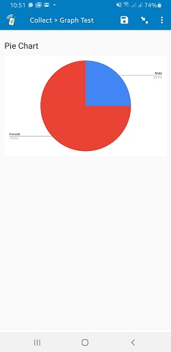

# Display iframe
Display a web-published graph from a Google Sheet.

## Description

This field plug-in allows you to display content from a web source in [an iframe](https://www.w3schools.com/tags/tag_iframe.asp) as part of your form. The principle tested use case is displaying a [web-published Google sheet graph](https://support.google.com/docs/answer/1047436?hl=en&ref_topic=1361474), but the field plug-in may work well for other use cases. The content to be displayed needs to be public so sensitive information should not be shared this way. It uses an internet connection to display.

## Features

* Supports displaying content that can be embedded in an iframe using a URL.
* Supports displaying the last update time, which is the last time the content was updated.
* Supports refreshing the content using the refresh button.

## Data Format

The plug-in works on a [text field](https://docs.surveycto.com/02-designing-forms/01-core-concepts/03a.field-types-text.html). The field does not save any data but is meant as a visual aid.

## How to use

1. Download the test form [extras/sample-form](https://github.com/surveycto/display-graph/raw/master/extras/sample-form/Sample%20form%20-%20Display%20graph.xlsx) from this repo and upload it to your SurveyCTO server.
1. Download the [display-graph.fieldplugin.zip](https://github.com/surveycto/display-graph/raw/master/display-graph.fieldplugin.zip) file from this repo, and attach it to the test form on your SurveyCTO server.
1. Make sure to provide the correct parameter (see below).

## Parameters

| **Key** | **Value** |
| --- | --- |
| `link (required)` | The link generated in Google sheets. You can follow the steps in [this article](https://support.google.com/docs/answer/1047436?co=GENIE.Platform%3DDesktop&hl=en) to get the link to your chart. |

> **Example:**  
> To display this [sample chart](https://docs.google.com/spreadsheets/d/1MPdvQXLbRaX6OD6EoA4OS-p0OxjUnn4m3rsC1JPdG6U/edit#gid=135270451) in the form, you would have the following in the appearance column:

`custom-display-graph(link="https://docs.google.com/spreadsheets/d/e/2PACX-1vQnMZpxa6JZjIuM8I9yowgtuyrkXBDcP_ULnJoNHjuD7zGacUX0g4zVSmYnfaAD6rSCTPwvsiDKOmxb/pubchart?oid=1569534844&format=interactive")`

## More resources

* **Sample form**  
You can find a form definition in this repo here: [extras/sample_form](https://github.com/surveycto/table-list/raw/master/extras/example_form/table-list%20sample%20folder.zip).

* **Developer documentation**  
More instructions for developing and using field plug-ins can be found here: [https://github.com/surveycto/Field-plug-in-resources](https://github.com/surveycto/Field-plug-in-resources)

* **User documentation**
How to get started using field plug-ins in your SurveyCTO form.
(https://docs.surveycto.com/02-designing-forms/03-advanced-topics/06.using-field-plug-ins.html)
